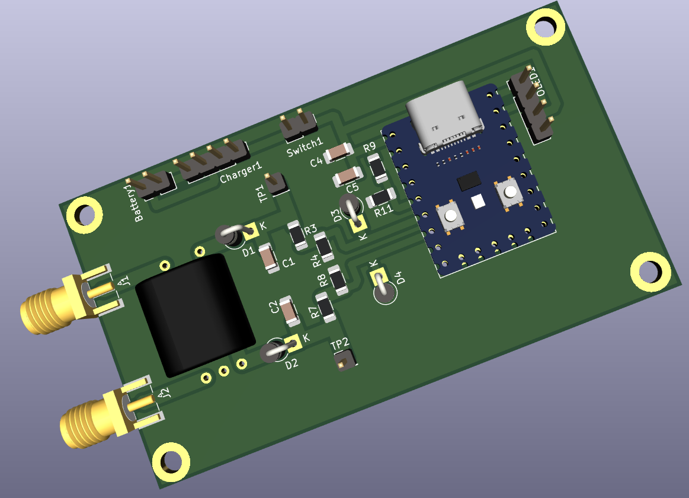

#### PCB Renderings

Note: The PCB design was validated on 28th-October-2022 - it works well over HF
range (1.8 MHz to 50 MHz).

This project uses the https://github.com/earlephilhower/arduino-pico core.

We have tuned the `curve fitting` to match that of `LUNARIS G6 HF VHF UHF SWR
METER` from `Ceda-Labz`.

Install this core in Arduino IDE, and then select `Generic RP2040` as the
target board.

Cost to build (in INR): Less than 1200 INR including the OLED screen, and PCB
from JLPCB.

#### Build Notes

- Calibration of every build can potentially differ.

#### BOM + Sources

Download and open `ibom.html` in your local browser.

- https://robu.in/product/waveshare-rp2040-zero-raspberry-pi-mcu-with-presoldered-header/ (https://rarecomponents.com/ has it too)

- https://robu.in/product/0-96-inch-i2c-iic-oled-lcd-module-4pin-with-vcc-gnd-white/ (5v compatible with 3.3v I2C lines)

- https://www.electronicscomp.com/ (1206 SMD components, https://www.comkey.in/ and https://evelta.com are better sources)

- ST 1N5711 diodes (https://www.semikart.com/)

- BN-43-202 (https://www.semikart.com/)

- https://projectpoint.in/ (24 + 27 SWG winding wire, high quality jumpers)

- https://www.ktron.in/ (SMA edge connector)

#### References

- https://sites.google.com/site/lofturj/power-and-swr-meter

- https://g8gyw.github.io/ (upstream project, see the binocular toroid windings instructions here)
